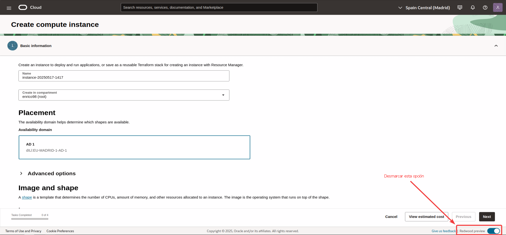
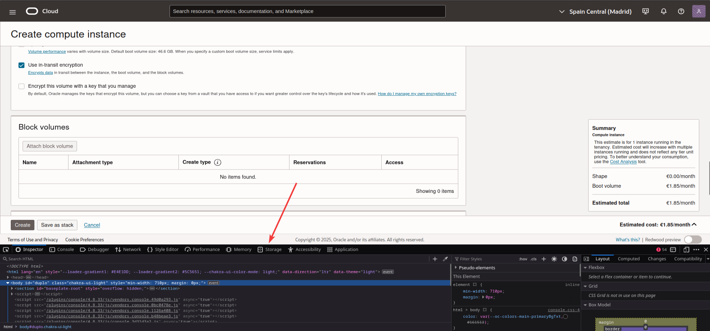
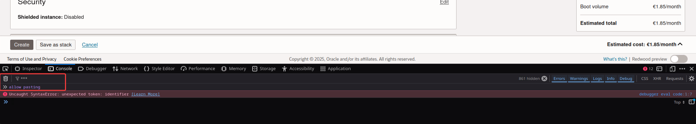
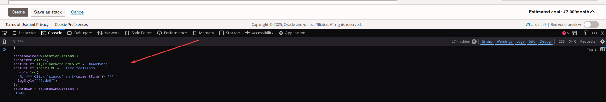
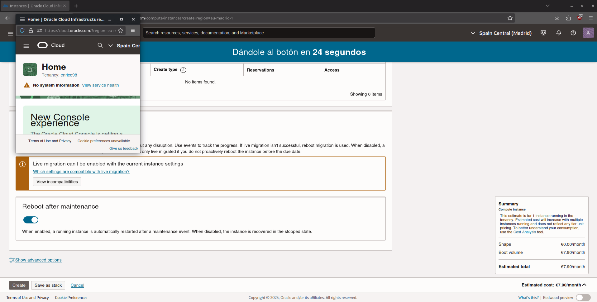
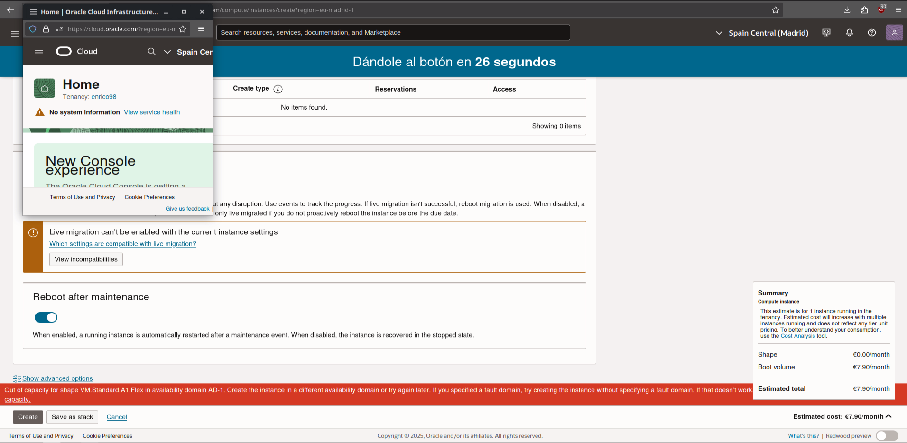

# Crear instancias de Oracle a través de Javascript utilizando la consola de desarrollador

Adaptación al español de las instrucciones realizadas por gardinbe, para simplificar el proceso. (https://github.com/gardinbe/oracle-compute-instance-creation-script).

## Requisitos previos

- Haberse dado de alta en Oracle con una cuenta (gratuita, trial, Pay As You Go) -- Tutorial -> https://XXXXX.

## Pasos a realizar

Importante, a la hora de crear nuestra instancia **será necesario desmarcar la opción de "Redwood Preview"** ya que este script está adaptado a la interfaz antigua/clásica.

1. **Crearemos nuestra instancia** en https://cloud.oracle.com/compute/instances/create según la configuración y capacidad que queramos tener en nuestra instancia.

> Lo idóneo será que seleccionemos la capacidad que nos permite tener una máquina con 4vCPU, 24GB de RAM y 200GB de disco duro.

2. Cuando estén rellenados todos los pasos y únicamente quede darle al botón de "Create" o "Crear", **abriremos la consola de desarrollador del navegador** (pulsando F12 o navegando desde las opciones del navegador).

Según el navegador que utilicemos, esta consola se abrirá en el lateral de la página web o en la parte inferior; en este ejemplo sería utilizando el navegador de Mozilla Firefox.

3. Iremos al apartado de **"console"** y escribiremos el mensaje siguiente, que nos permitirá copiar el contenido del script en el siguiente paso: `allow pasting`.

4. **Copiaremos el contenido del fichero** "script.js", lo pegaremos en dicha consola y lo ejecutaremos.

5. Se nos **abrirá una ventana emergente** que no deberemos cerrar, junto a un contador indicando que en X segundos se le dará al botón de "Create".

6. En caso de que falle (lo más normal) **nos aparecerá un banner indicando que "no hay capacidad"** en la región seleccionada.

7. Dicho botón **se pulsará automáticamente cada 30 segundos.** Esperaremos hasta que la instancia se haya creado correctamente.

# Notas

- Este método **no es el más recomendable**, pero es el más sencillo en caso de no tener nociones informáticas; en caso de querer realizar esto por API, se puede seguir la info del otro [repositorio](https://github.com/enkirro/oracle-creacion-instancias-api)

- Es **muy recomendable** tener la cuenta en Pay As you Go, sino el fallo por capacidad en una cuenta "gratuita" es algo muy típico.

- **NO CERRAR LA VENTANA EMERGENTE** (*o nos echará por inactividad a los pocos minutos*).

- **Filtrar los logs** en la consola indicando '***' en caso de querer debuggear algo.

- Es **ideal cerrar la consola de desarrollador** para evitar que pueda "crashear" la página de Oracle (*fallo en su extremo*).

- Se puede cambiar el intervalo modificando la variable `"INTERVAL_DURATION"` en el script.js. De forma predeterminada se ejecutará cada 30 segundos. (*es ideal no modificarlo ya que Oracle nos puede restringir*).
